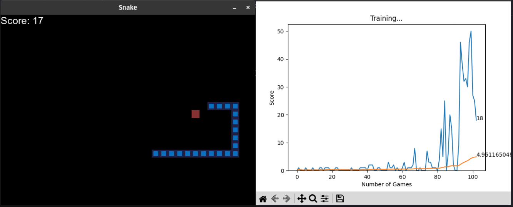

# Snake Game AI

Experiment: Training a PyTorch AI to play Snake

Based on this [Github project](https://github.com/patrickloeber/snake-ai-pytorch) by Patrick Loeber. A tutorial is available on [YouTube](https://youtu.be/L8ypSXwyBds).

## Table of Contents
- [Project Overview](#project-overview)
- [Features](#features)
- [Demo](#demo)
- [Getting Started](#getting-started)
  - [Prerequisites](#prerequisites)
- [License](LICENSE)

## Project Overview

Snake is a classic computer game where a string of squares (the snake) move around in a grid trying to collect apples (the red square). Each time the apple is collected by the head of the snake, it is randomly placed somewhere else on the grid. If at any point the snake runs into the edge of the grid or runs into itself, the game is over.

This project is a perfect example to showcase the capabilities of AI in reinforcement learning. AI is great at finding patterns in data and can be used to automatically make choices based on previous experiences. In this case, the AI is given the direction of the apple and if there is danger (wall or itself) around it. It must decide if it should go straight, turn left, or turn right.

## Features

- Basic snake python game using pygame.
- Pytorch model being trained.
- Agent to help train the AI and apply the decisions the AI makes to the game.

## Demo

## Getting Started

To run this project, simply...

1. Download the repository
2. Setup Python environment
3. Run `snake_agent.py`

### Prerequisites

- A Python 3.10 environment
- Install requirements in the `requirements.txt` using `pip install -r requirements.txt`
- This project will work with or without a GPU

